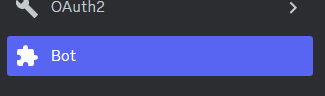
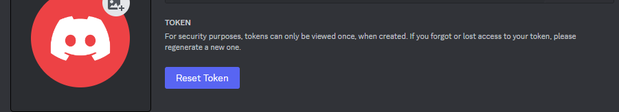
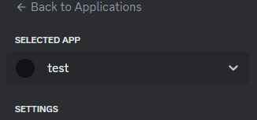
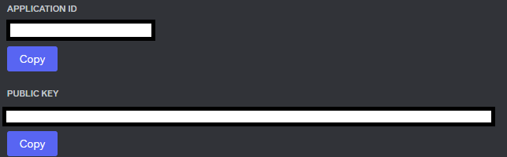

# Discord Bot 생성 방법
1. 앱 생성하기
2. `Bot`탭에서 앱의 봇 생성하기
3. `Oauth2`탭에서 Bot의 권한 설정하기
4. 디스코드 링크를 복사하여 브라우저 주소창에서 실행하기

# Discord Bot App 생성시 필요한 토큰 위치
* Discord Token

해당 토큰은 따로 기록해두거나 매번 Reset해서 새로 만들어야 함

* Application ID & Public Key
  
  위의 그림처럼 생성한 Bot에 접근하면
  
  위의 그림과 같이 ID, Key 얻을 수 있음

* 
# Discord 채널에 Bot 추가하기
1. 봇을 적용할 서버의 설정(톱니바퀴)를 누르기
2. `Advanced` 탭에서 개발자 모드 켜기
3. 사용하고자 할 채널 우클릭 후, copy ID를 눌러 ID 정보 획득하기