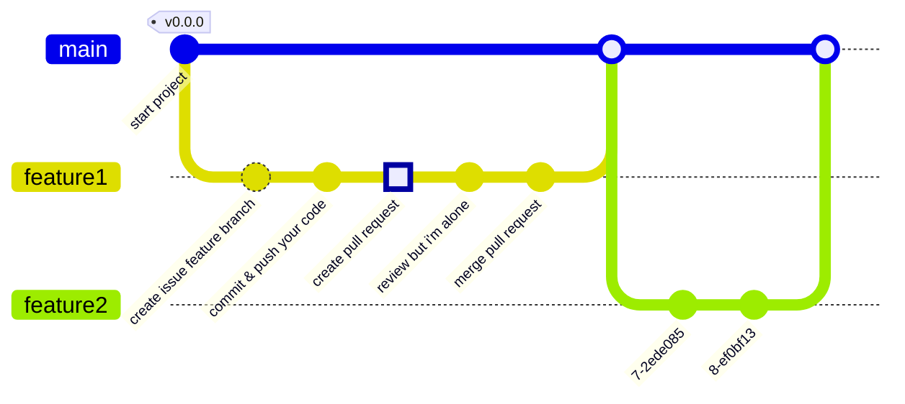

# Git Convention
혼자 간단한 서비스를 개발하는 것이라서 간단한 github flow 전략을 따라 개발을 진행합니다.

## Branch
>  github flow을 사용합니다.

## Commit
```
#이슈번호-키워드: 한 줄 커밋

필요한 경우 상세 내용
```
### 키워드 목록
* docs : 문서 작성하는 경우
* feat : 기능 구현한 경우
* refactor : 가시성을 높이는 경우, 코드를 정리하는 경우
* fix : 문제가 발생해서 수정하는 경우

## 참고자료
* [[GIT] 📈 깃 브랜치 전략 정리 - Github Flow / Git Flow](https://inpa.tistory.com/entry/GIT-%E2%9A%A1%EF%B8%8F-github-flow-git-flow-%F0%9F%93%88-%EB%B8%8C%EB%9E%9C%EC%B9%98-%EC%A0%84%EB%9E%B5)