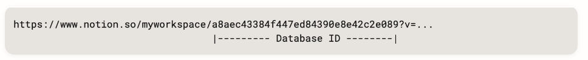

# notion develop docs
notion integration을 만들기 위해서 필요한 내용을 정리합니다.

## Notion DB에서 조건에 맞는 데이터 가져오는 법

### 사전에 준비해야 할 것들
1. integration 생성 및 통합 토큰 준비
2. notion 데이터베이스를 integration과 공유
3. notion 데이터베이스 ID 준비
4. notion 데이터베이스 접속을 위한 데이터 셋팅

#### 1. integration 생성 및 통합 토큰 준비
1. notion 계정을 만들고 https://www.notion.so/my-integrations에 접속하세요.
2. 새 API 통합을 눌러 만드세요.   
3. 이름을 설정해주세요.
4. 아래에 기능에서 필요한 권한들을 설정해주세요.
5. 제출을 눌러 생성해주세요.
6. 생성 후 프라이빗 API 통합 토큰을 기록해주세요.

#### 2. notion 데이터베이스를 integration과 공유
1. 공유하고자 하는 notion database를 생성해주세요.
2. 우측 상단의 $\cdots$를 눌러주세요.
3. 맨 아래쪽 $+$연결 추가 버튼을 눌러서 [integration 생성 및 통합 토큰 준비](#1-integration-생성-및-통합-토큰-준비)에서 만든 integration 이름을 추가해주세요.

#### 3. notion 데이터베이스 ID 준비
1. notion에서 데이터베이스를 생성해주세요.
2. 해당 데이터베이스를 전체보기로 열어주세요.
3. 주소에서 아래 그림과 같은 부분이 데이터베이스 ID입니다.
   

#### 4. notion 데이터베이스 접속을 위한 데이터 셋팅
* API_KEY : [1번에서 구한 통합 토큰입니다.](#1-integration-생성-및-통합-토큰-준비)
* DATABASE_ID : [3번에서 구한 데이터베이스 ID입니다.](#3-notion-데이터베이스-id-준비)

### post man으로 테스트 환경 구성
1. 사전 변수 설정
2. DB 정보 가져오기
3. DB에서 조건에 맞는 정보 가져오기

#### 1. 사전 변수 설정
> 해당 부분은 필수는 아니지만 post man을 조금이라도 편하게, 안전하게 사용할 수 있는 기능입니다.
1. $+$버튼을 눌러 컬렉션을 생성합니다.
2. 컬렉션을 누르면 우측화면 `Variables` 탭에 들어가 변수와 값을 설정합니다.
3. [4. notion 데이터베이스 접속을 위한 데이터 셋팅](#4-notion-데이터베이스-접속을-위한-데이터-셋팅)의 변수와 값을 추가해줍니다.
4. `NOTION_VERSION` : `2022-06-28` [(입력 가능한 버전)]() 을 추가해줍니다.
5. `Authorization` 탭에 들어가서 `Type`은 `Bearer Token`을 설정하고 `Token`에는 `{{API_KEY}}`를 입력합니다.

#### 2. DB 정보 가져오기
1. 컬렉션의 우측 $\cdots$를 눌러 `Add request`를 눌러 원하는 요청을 생성합니다.
2. DB 정보를 읽어오기 위해선 `GET` 방식으로, url은 `https://api.notion.com/v1/databases/:id`으로 설정합니다.
3. `Params`탭에서 Path Variable `id`는 `{{DATABASE_ID}}`를 설정합니다.
4. `Headers` 탭에서 `Notion-Version`은 `{{NOTION_VERSION}}`으로 설정합니다.
5. Send를 눌러 응답을 확인합니다.

#### 3. DB에서 조건에 맞는 정보 가져오기
> Body에 추가하는 query를 통해 조건에 맞는 데이터를 가져오기 때문에 Post방식입니다.

1. 컬렉션의 우측 $\cdots$를 눌러 `Add request`를 눌러 원하는 요청을 생성합니다.
2. DB 정보를 읽어오기 위해선 `POST` 방식으로, url은 `https://api.notion.com/v1/databases/:id`으로 설정합니다.
3. `Params`탭에서 Path Variable `id`는 `{{DATABASE_ID}}`를 설정합니다.
4. `Headers` 탭에서 `Notion-Version`은 `{{NOTION_VERSION}}`으로 설정합니다.
5. `Body` 탭에서 `raw`를 선택하고 데이터 형식은 `JSON`을 선택합니다.
6. 아래와 원하는 데이터의 조건을 작성하여 추가합니다. ([query 작성 방법](https://developers.notion.com/reference/post-database-query-filter)/[정렬 방법](https://developers.notion.com/reference/post-database-query-sort))
```
{
  "filter": {
    "property": "날짜",
    "date": {
        "equals" : "2023-04-01"
    }
  },
  "sorts": [
                {
            "property": "날짜",
            "direction": "descending"
        }
    ]
}
```
7. Send를 눌러 응답을 확인합니다.


## 참고자료
* [Create an integration](https://developers.notion.com/docs/create-a-notion-integration)
* [Notion's API Workspace](https://www.postman.com/notionhq/workspace/notion-s-api-workspace/overview)