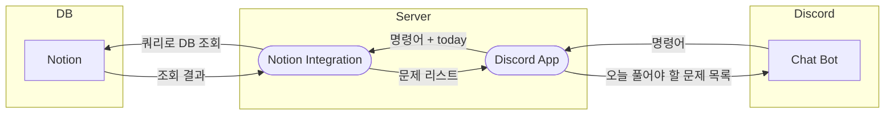

# 프로젝트 목적
> Discord와 Noiton을 이용하여 필요한 기능을 제공하는 프로젝트

# v 0.0.0 목표

# 문서 목록
* [Git Convention](docs/Git%20Convention.md)
* [개발 환경](docs/%EA%B0%9C%EB%B0%9C%20%ED%99%98%EA%B2%BD.md)
* [Discord 참고사항](docs/Discord%20%EC%B0%B8%EA%B3%A0%EC%82%AC%ED%95%AD.md)
* [Notion 참고사항](docs/Notion%20%EC%B0%B8%EA%B3%A0%EC%82%AC%ED%95%AD.md)

